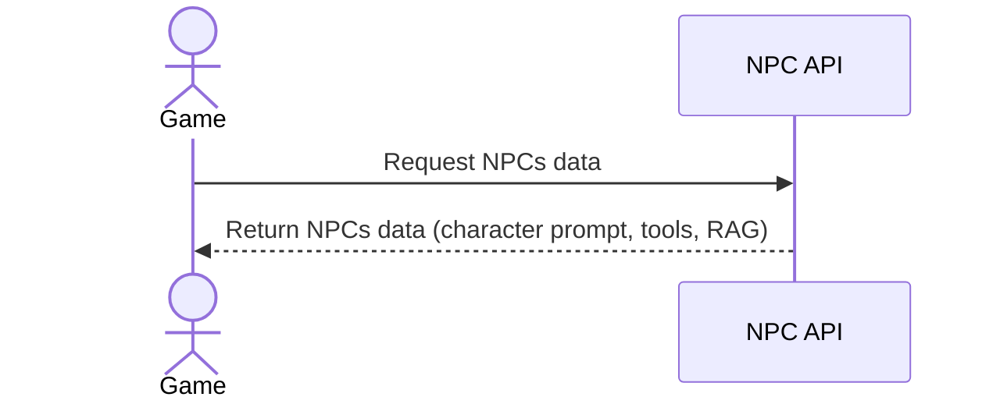
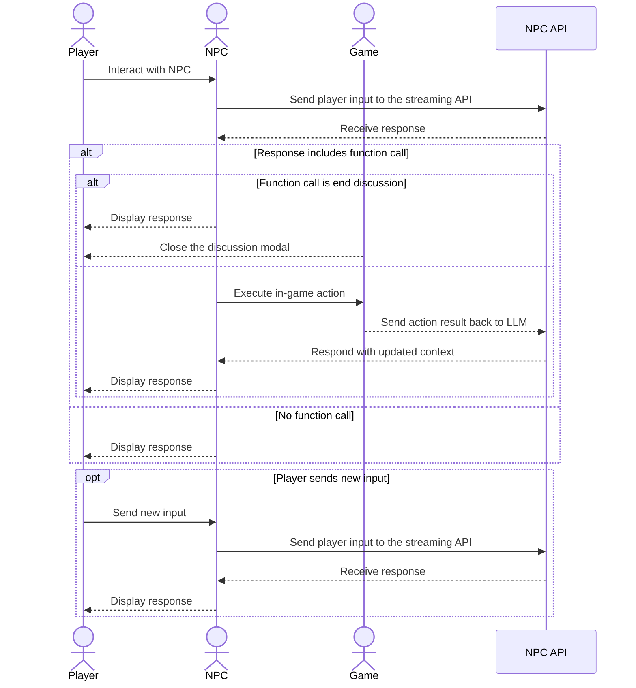

# Project name

**Project name** is a Unity prototype demonstrating how Large Language Models (LLMs) can be used to enable dynamic, unscripted interactions with NPCs in video games.

## Context

This project was developed as part of the [Mistral Worldwide hackathon - online edition](https://luma.com/mistralhack-online) within a strict 48-hour timeframe. The goal was to showcase the potential of generative AI in gaming, specifically by creating dynamic NPC interactions that provide players with a much more immersive and engaging experience.

## Features

- **Dynamic NPC Interactions**: Players can converse with NPCs using natural language, breaking free from traditional dialogue trees.
- **Context-Aware Responses**: NPCs understand the current state of the game world and respond accordingly, creating a realistic and dynamic environment.
- **Mistral AI Integration**: The project is powered by Mistral's LLM capabilities to generate high-quality dialogue and manage the flow of interaction.
- **Function Calling**: Beyond just chatting, the project demonstrates how LLM function calling enables NPCs to perform actual in-game actions based on the conversation (e.g., giving quests, spawning items, or modifying world states).

## Getting Started

### Prerequisites
- Unity version 6.3 LTS (6000.3.9f1)
- The URL to the NPCs management API (provided in [this repository](https://github.com/KysioD/mistral-hackaton-online-2026-backoffice))

### How it works

All NPCs in the game are managed through an API. This permits to easily add or edit NPCs without needing to update the game, but also to improve the NPCs behaviour by updating their conf in the backoffice.
Each NPC has a character prompt and a list of tools.
Also, to reinforce consistency in the NPCs behaviour, each NPC has a dedicated RAG with multiple conversation examples and lore information.

This system was thought to be used by game designers to create NPCs with a complete personality and offering more narative possibilities, adapting to the evolution of the player in the game and how they interact with the world.

#### Loading the npcs

All the NPCs are loaded at the start of the game by calling the API.

#### Interacting with an NPC

When the player interacts with an NPC, the game sends the player's input along with the NPC's character prompt and relevant RAG information to the Mistral API. The LLM processes this information and generates a response, which is then sent back to the game and displayed to the player.
If the response includes a function call, the game executes the corresponding in-game action and sends the result back to the LLM for further context in the conversation.

